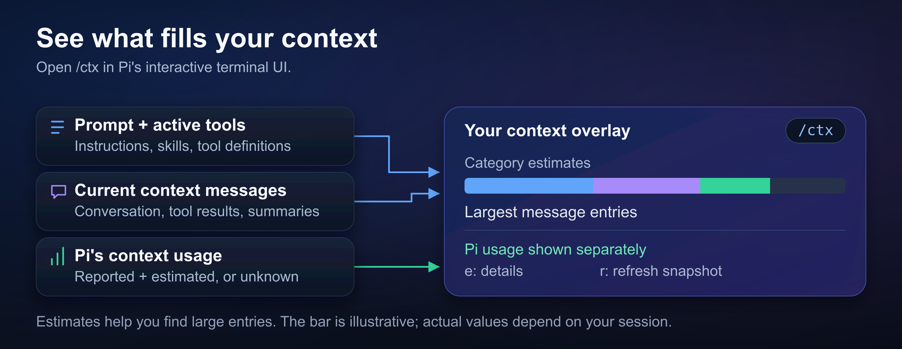

# pi-ctx-info

`/ctx` shows what's filling your [Pi](https://pi.dev) session's context window. Open it when a session is getting large and you want to find the messages or tool results taking up space.



*Open `/ctx` to see Pi's usage alongside an estimated breakdown; press `e` to explore the details.*

## Quick start

Requires Node.js 24.15+ and official Pi 1.0.0+ or the current [fitchmultz/pi](https://github.com/fitchmultz/pi) fork.

```sh
pi install git:github.com/fitchmultz/pi-ctx-info
pi
```

Type `/ctx` in Pi's interactive terminal UI. To try it for one session without installing:

```sh
pi -e git:github.com/fitchmultz/pi-ctx-info
```

Next: [explore the overlay](#explore-the-overlay) or [understand the numbers](#understand-the-numbers).

## Explore the overlay

The overlay opens over your conversation. A color bar breaks the context into categories, with Pi's usage figure above it and the five largest message entries below. If `Tool results` looks large, check `largest entries` for big responses.

Press `e` to see every discovered context file, skill, and active tool. The expanded view also shows up to ten largest entries.

| Key | Action |
| --- | --- |
| `e` | Expand or collapse details |
| `↑` / `↓` | Scroll |
| `Home` / `End` | Jump to the start or end |
| `r` | Recompute the snapshot |
| `Esc` / `q` / `Enter` | Close the overlay |

The overlay is available in the interactive TUI; print and RPC modes cannot show it.

## Understand the numbers

Pi's usage figure and the composition estimate are separate. The breakdown uses Pi's characters-divided-by-four heuristic, so its category totals and estimated free space can differ from Pi's `reported + estimated` usage.

You may see `unknown` after a context boundary until fresh usage is available. If there's no model, usage is `unavailable`.

The prompt note tells you whether the estimate includes the last prepared request's instructions. After reload or resume, Pi may expose only its base prompt until another request is prepared, leaving some per-run extension guidance out of the estimate.

The breakdown follows Pi's current model context, including retained messages and summaries. It applies context edits and leaves out discarded conversation. Later extension transformations and provider-payload rewrites are outside this estimate; the [accounting reference](docs/reference.md#accounting-basis) explains the details.

## More information

See [development and compatibility testing](docs/development.md) to work on the extension, or the [reference and version history](docs/reference.md) for more detail. Found a problem? [Open an issue](https://github.com/fitchmultz/pi-ctx-info/issues).

## License

[MIT](LICENSE) · Copyright © 2026 Mitch Fultz.
